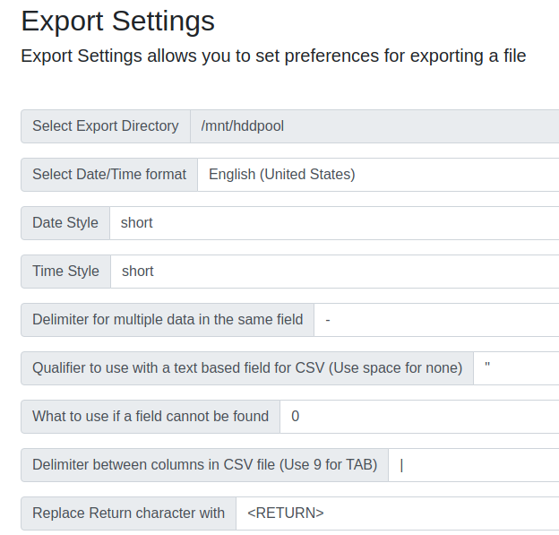
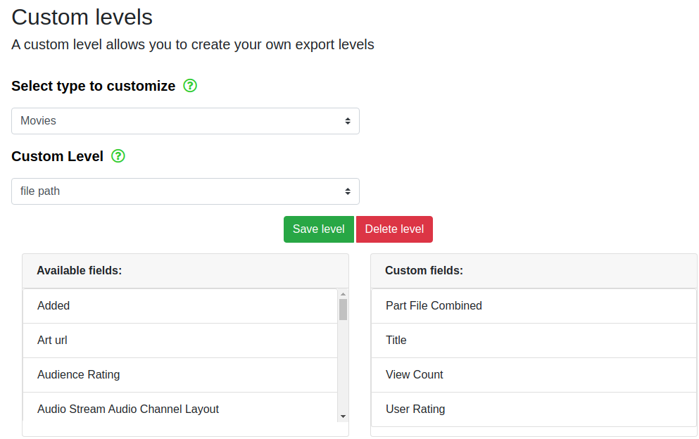

# plex-to-stash-ratings

## Transfer scene rating and view count from Plex to Stash.

### NOTE: Intended for fresh installs before previous view/rating counts exist.

Matches file paths between Plex and Stash DBs to find the Stash IDs. Assumes file paths are the same (like with docker mounts). If your parent folders differ, you can easily find&replace it in your files.

# 1. Plex export using [WebTools-NG](https://github.com/WebTools-NG/WebTools-NG/releases)
- Download WebTools and sign in to select your server.
- Set your settings as shown below



# 2. Stash export using `curl`, or your preferred API program.

Run the below command, substituting your API Key and URL. Make sure the output file matches your config.json.
```
curl -X POST -H "ApiKey: API_KEY_HERE" -H "Content-Type: application/json" --data '{ "query": "{ allScenes { id path } }" }' STASH_GRAPHQL_URL > allScenes.json
```

# 3. Setup `config.json`:

```
{
    "plex_csv": "ratings_views.csv",
    "stash_json": "allScenes.json",
    "graphql_url": "",
    "graphql_api_key": ""
}
```

# 4. Install dependencies
`pnpm install`


# 5. Run
`pnpm ts-node migratePlexRatingViewsToStash.ts`